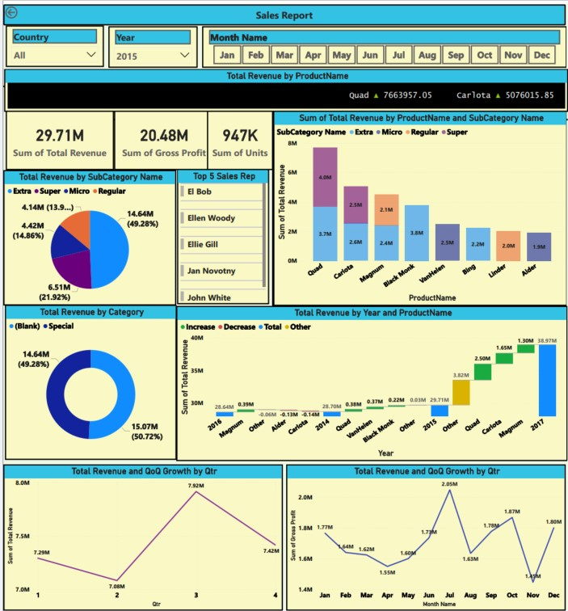

# Sales Analysis Power BI Report

## Overview
This project involves the creation of a **Sales Analysis Power BI Report** to provide actionable insights into sales performance. The report consolidates data from multiple sources, applies advanced data modeling techniques, and uses DAX calculations to generate key metrics and visualizations. The final deliverable includes an interactive Power-BI Report for easy access and sharing.

## Preview
### Power-BI Sales-Report ScreenShot

## Features
- **Data Integration**: Combines data from multiple sources, including Excel, CSV, and databases.
- **Data Modeling**: Establishes relationships between tables and creates a robust data model.
- **DAX Calculations**: Implements advanced measures for revenue, cost, profit, and growth analysis.
- **Interactive Report**: Provides a one-page Report with visuals for sales insights.
- **Scalable Mechanism**: Automatically handles new or missing sales data files without errors.
- **Time-Based Analysis**: Includes Qtr-on-Qtr growth, Month-on-Month growth, and average sales per day.

## Data Sources
The project uses the following data sources:
1. **Sales** (folder by year)
2. **Categories** (Excel)
3. **Geography** (Excel)
4. **Product** (CSV/Database)
5. **SalesRep** (Excel)
6. **SubCategories** (Excel)

## Key Tasks and Steps

### 1. Data Gathering and Loading
- Created a mechanism to load all files from the Sales folder into a single Sales fact table.
- Ensured the mechanism is resilient:
  - Missing files do not cause errors.
  - New yearly sales files are automatically loaded upon refresh.

### 2. Data Modeling
- Transformed the Sales fact table:
  - Split "Country" and "City" from the "Location" field.
  - Updated the Date field to ensure proper formatting.
- Created a unique key (`GeoKey`) in the Sales and Geography tables.
- Cleaned ID columns in the SalesRep and SubCategory tables using a reusable function.
- Connected all tables in the data model using the Calendar table.

### 3. DAX Calculations
- **Total Revenue**: Calculated as `Retail Price * Units`.
- **Total Cost**: Calculated as `Standard Cost * Units`.
- **Gross Profit**: Calculated as `Total Revenue - Total Cost`.
- **Gross Profit MoM Growth %**: Measure to track month-over-month growth.
- **Average Sales Per Day**: Measure for average daily revenue based on actual sales dates.
- **QoQ Growth**: Measure for quarter-over-quarter growth.
- **Breakdown Analysis**: Measures for product performance (drop or increase) using Waterfall chart. 

### 4. Power-BI Report Visualizations
- Assembled a one-page Power-BI Report with the following features:
  - Interactive filters for region, product category, and time period.
  - Visualizations include bar charts, line graphs, KPIs, and geo maps.
  - Time-based analysis with months sorted from January to December.
- Designed the Report to provide actionable insights for decision-making.

## How to Use
1. **Download the `.pbix` File**:
   - Clone this repository and download the Power BI report file.
2. **Open in Power BI Desktop**:
   - Open the `.pbix` file in Power BI Desktop to explore the report.

## Key Insights
- **Revenue Trends**: Identify sales trends over time and across regions.
- **Profitability**: Analyze gross profit and its growth over time.
- **Product Performance**: Understand which products are driving sales and which need attention.
- **Geographical Insights**: Visualize sales performance by geography.

## Tools and Technologies
- **Power BI Desktop**: For data modeling, DAX calculations, and report creation.
- **Power BI Service**: For publishing and sharing the report.
- **Data Sources**: Excel, CSV, and database files.
